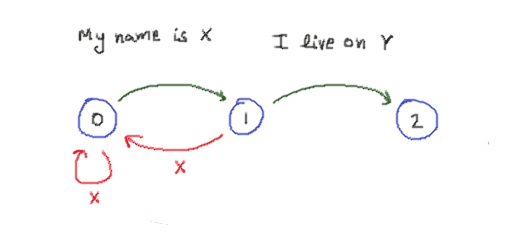

# FSM

Match any kind of text based pattern in the input text.

Suppose you need to find a set of lines where it says "My name is X" followed by "I live on Y" in the following lines of text -

```
My name is Ricky.
I live on Earth.
My name is Mort.
I live on Mars.
```

The normal text matching can happen using Regular Expressions. It's very powerful. But sometimes (when parsing nginx logs for example) we need to look for patterns that are spread across lines of text. This is where finite state machines (FSM) can help.

In a finite state machine, you can define multiple states, and their transition logic. This way you can create any kind of string matching pattern you want.

For the above example, we can create a finite state machine like this -



The way you'll define a finite state machine in code like this is -

```
2
My name is \w+\.
I live on \w+\.
0 1 o
0 0 x
1 2 o
1 0 x
```

In the above file, we are defining our finite state machine. We are saying we want a machine with 2 states. The regular expressions for those states are what follows on the next two lines. Then the rest of the file contains the transition logic between the states.

`0 1 o` means, move from state 0 to state 1 if regular expression for state 1 matches the given input.  
`0 0 x` means, stay on state 0 if you don't get a match.  
`1 2 o` means, if you're on state 1 and regular expression for state 2 matches the given input, move to state 2.  
`1 0 x` means, if you're on state 1, and you don't get a match, go to state 0.